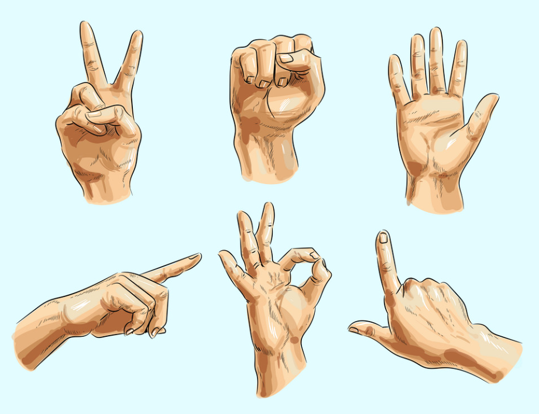

# Hand Gesture Recognition System

A real-time hand gesture recognition system using Python, OpenCV, and MediaPipe that can detect various hand gestures through your webcam.



## Features

- Real-time hand tracking and gesture recognition
- Support for multiple gestures including:
  - OK sign
  - Thumbs up
  - Peace sign
  - Stop/Open palm
  - Rock sign
  - Pointing
  - Fist
  - Numbers (1-5)
  - Call gesture
- FPS display
- Support for both left and right hands
- Visual feedback with bounding boxes and labels
- Hand skeleton visualization

## Requirements

- Python 3.9+
- Webcam
- Windows/macOS/Linux

## Installation

### 1. Create Conda Environment

```bash
# Create new conda environment
conda create -n hand_gesture python=3.9 -y

# Activate the environment
conda activate hand_gesture
```

### 2. Install Dependencies

```bash
# Install required packages
pip install opencv-python mediapipe numpy scikit-learn
```

## Project Structure

```
hand-gesture-recognition/
├── hand_gesture_recognition.py   # Main application
├── camera_test.py               # Camera testing utility
├── setup.py                     # Setup script
└── README.md                    # This file
```

## Quick Start

### 1. Test Your Camera

First, ensure your camera is working properly:

```bash
python camera_test.py
```

This will test all available cameras and show which one works.

### 2. Run the Application

```bash
python hand_gesture_recognition.py
```

### 3. Using the Application

- Position your hand in front of the camera
- The system will detect and display the recognized gesture
- Press 'q' or ESC to exit

## Code Structure

### Main Components

1. **HandGestureRecognizer Class**

   - Initializes MediaPipe hand detection
   - Manages camera capture
   - Processes frames and detects gestures
   - Handles UI rendering

2. **Gesture Classification**

   - Analyzes finger positions
   - Determines which fingers are extended
   - Classifies gestures based on finger patterns

3. **FPS Calculation**
   - Tracks frame processing speed
   - Displays current FPS on screen

## Supported Gestures

| Gesture     | Description              | Fingers Extended       |
| ----------- | ------------------------ | ---------------------- |
| OK          | Thumb and index touching | Middle, ring, pinky up |
| Thumbs Up   | Only thumb extended      | Only thumb             |
| Stop        | All fingers extended     | All five fingers       |
| Peace       | V sign                   | Index and middle       |
| Rock        | Rock and roll sign       | Thumb, index, pinky    |
| Pointing    | Index finger pointing    | Only index             |
| Fist        | Closed hand              | None                   |
| Numbers 1-5 | Count with fingers       | Corresponding number   |
| Call        | Phone gesture            | Thumb and pinky        |

## Troubleshooting

### Camera Not Working

If you see a blank window or camera errors:

1. **Run the camera test script**:

   ```bash
   python camera_test.py
   ```

2. **Check camera availability**:

   - Ensure no other application is using the camera
   - Try Windows Camera app to verify camera works

3. **Update the camera index**:

   - If camera test shows a different index works, update the main script:

   ```python
   recognizer = HandGestureRecognizer(camera_index=1)  # Change to working index
   ```

4. **Try different backends**:
   - The script tries DirectShow by default on Windows
   - You can modify the backend in the code if needed

### Low FPS

If the system is running slowly:

1. **Reduce camera resolution**:

   ```python
   cap.set(cv2.CAP_PROP_FRAME_WIDTH, 320)
   cap.set(cv2.CAP_PROP_FRAME_HEIGHT, 240)
   ```

2. **Adjust MediaPipe settings**:
   ```python
   self.hands = self.mp_hands.Hands(
       static_image_mode=False,
       max_num_hands=1,  # Reduce to single hand
       min_detection_confidence=0.7,  # Increase threshold
       min_tracking_confidence=0.7
   )
   ```

### Gesture Not Recognized

If gestures aren't being detected properly:

1. **Ensure good lighting**
2. **Keep hand within camera frame**
3. **Try adjusting the confidence thresholds**
4. **Make gestures clear and distinct**

## Code Examples

### Basic Usage

```python
# Initialize recognizer
recognizer = HandGestureRecognizer()

# Run the application
recognizer.run()
```

### Custom Gesture Addition

To add a new gesture, modify the `analyze_finger_positions` method:

```python
def analyze_finger_positions(self, points):
    # ... existing code ...

    # Add custom gesture
    if fingers_up[0] and fingers_up[2] and not fingers_up[1]:
        return "Custom Gesture", 0.9

    # ... rest of the code ...
```

### Adjusting Detection Parameters

```python
# In __init__ method
self.hands = self.mp_hands.Hands(
    static_image_mode=False,
    max_num_hands=2,
    min_detection_confidence=0.5,  # Lower = more sensitive
    min_tracking_confidence=0.5    # Lower = smoother tracking
)
```

## Performance Optimization

### For Better FPS

1. **Use HOG model instead of CNN**:

   ```python
   self.detection_model = "hog"  # Faster but less accurate
   ```

2. **Process every nth frame**:

   ```python
   frame_skip = 2
   if frame_count % frame_skip == 0:
       # Process frame
   ```

3. **Reduce image size before processing**:
   ```python
   small_frame = cv2.resize(frame, (320, 240))
   results = self.hands.process(small_frame)
   ```

## Advanced Features

### Adding Gesture Smoothing

The advanced version includes gesture smoothing to reduce flickering:

```python
# Store gesture history
self.gesture_history = deque(maxlen=5)

# Smooth gesture over time
def smooth_gesture(self, gesture, confidence):
    self.gesture_history.append((gesture, confidence))
    # Return most common gesture in history
    return most_common_gesture
```

### Multi-Hand Support

The system supports tracking both hands simultaneously:

```python
# Process multiple hands
for hand_landmarks, handedness in zip(
    results.multi_hand_landmarks,
    results.multi_handedness):

    hand_label = handedness.classification[0].label  # "Left" or "Right"
    # Process each hand separately
```

## Future Enhancements

1. **Machine Learning Classification**

   - Train a neural network for better accuracy
   - Support for more complex gestures

2. **Gesture Sequences**

   - Detect gesture patterns over time
   - Support for sign language

3. **3D Visualization**

   - Use depth information for better recognition
   - 3D hand model rendering

4. **Application Integration**
   - Control system functions with gestures
   - Game controls
   - Presentation controls

## License

This project is open source and available under the MIT License.

## Acknowledgments

- MediaPipe by Google for hand tracking
- OpenCV for computer vision functionality

## References

- [MediaPipe Documentation](https://google.github.io/mediapipe/solutions/hands.html)
- [OpenCV Documentation](https://docs.opencv.org/)
- [Hand Landmarks](https://google.github.io/mediapipe/solutions/hands.html#hand-landmarks)
